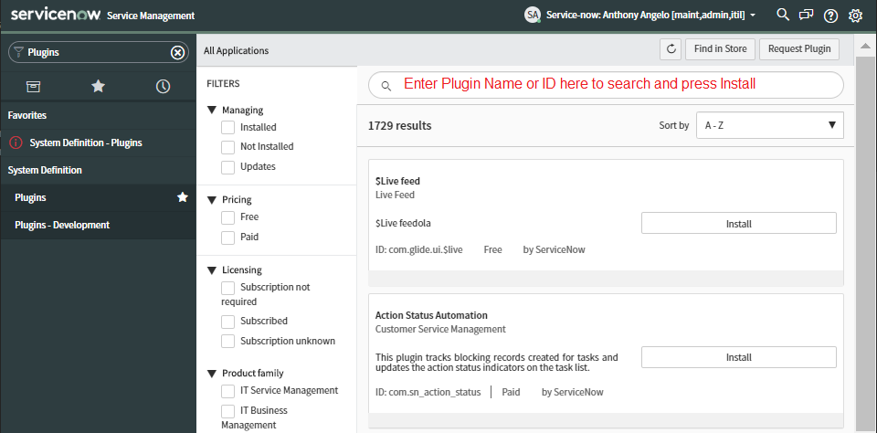

ServiceNow Scoped Application complatible with the Orlando Release. Implements a REST API for registering application services using a JSON payload used to describe the services and their relationships.

# Prerequisites

* ServiceNow Orlando Instance

## Install Plugins

You will need to install several required PlugIns into your ServiceNow instance. 

1. Login to your instance as  `Administrator`

1. Select the **Plugins** Menu Option

    

1. Continue to *Search*, *Install* and *Activate* each of the following Plugins:

    >NOTE: It can take several minutes to *Activate* each Plugin

    * Service Registration Plugins

        * Explicit Roles com.glide.explicit_roles
        * Discovery and Service Mapping Patterns sn_itom_pattern
        * ITOM Optimization Licensing com.sn_itom_opt_licensing
        * ITOM Guided Setup com.snc.guided_setup_metadata.itom
        * ITOM Licensing sn_itom_license
        * Service Mapping - Service Mapping com.snc.service-mapping
        * Event Management and Service Mapping Core - com.snc.service-watch
        * Event Management - com.glideapp.itom.snac
        * Event Management Overview Homepage com.glideapp.report.em
        * Performance Analytics - Content Pack - Event Management com.snc.pa.em
        * Performance Analytics - Content Pack - Operational Intelligence com.snc.sa.metric.pa.content
        * Alert Management Content com.em-alert-mgmt-content
        * Cloud Management com.snc.cloud.mgmt

## Create a Service Account for your APM

   * Create a User (e.g. `grafana`)
   * Grant the following Roles:
       * snc_internal
       * evt_mgmt_integration

## Install the Atlas Application Dependencies

1. Deploy the Following Dependencies from the `/servicenow` folder

    * XML File Imports:

        * DeleteAllGrafanaAlertsFixScript.xml - Utility to delete old Grafana Alarms
        * FindSysIDFixScript.xml - Utility to find Objects by SysID
        * CreateOrUpdateITServiceScriptInclude.xml - Changed to disable removal of outdated manual endpoints
        * LabsAtlasScriptInclude.xml - Wrapper for BusinessServiceManager not available from application scope
        * AlertManagementRulesExport.xml - Alert Management Rule to create an Incident automatically from the Alert

    * Update Sets:

        * TableIdentityRulesUpdateSet.xml - Table Identity Rules Update Set to set uniquenes for Application & HTTPs Endpoints Tables
        * CreateIncidentFromAlertFlowUpdateSet.xml - Flow Designer Workflow to create an Incident from an Alert

## Install the Atlas Scoped Application

1. Navigate to Studio

1. Import Application from Source Control as follows:

    * URL: https://github.com/pangealab/atlas.git
    * Branch: master

# Operations

## Register Service

Use the following `curl` command to register a service using the sample `bookinfo` json payload:

```
NOW_API=https://YOURSERVICENOWURL/api/x_snc_labs_atlas/v1/register/service
curl -X POST -H "Content-Type: application/json" $NOW_API --user YOURUSERID:YOURPASSWORD -d @bookinfo.json
```

For smaller payloads you can use the inline version of the payload as follows:

```
NOW_API=https://YOURSERVICENOWURL/api/x_snc_labs_atlas/v1/register/service
curl -X POST -H "Content-Type: application/json" $NOW_API --user YOURUSERID:YOURPASSWORD -d '{"name": "parent1","parent":null,"host":null}'
```

# Create Event

Use the following `curl` command to create an event using a Grafana webhook payload to send in alarms:

```
NOW_API=https://YOURSERVICENOWURL/api/x_snc_labs_atlas/v1/create/event
curl -X POST -H "Content-Type: application/json" $NOW_API --user YOURUSERID:YOURPASSWORD -d @alarm1.json
```

You can also use the inline version of the command for smaller Grafana alarm payloads:

```
curl -X POST -H "Content-Type: application/json" $NOW_API --user YOURUSERID:YOURPASSWORD -d '{"title":"Alarm 1","ruleId":"Rule ID 1","ruleName":"Rule Name 1","ruleUrl":"http://url.to.grafana/db/dashboard/my_dashboard?panelId=2","state":"alerting","imageUrl":"https://i.stack.imgur.com/hAz8I.png","message":"Message 1","evalMatches":[{"metric":"Metric 1","tags":{},"value":"99.99"}]}'
```

# Example Payloads

## bookinfo.json

    ```
    {
    "name": "Bookworms",
    "comments": "Bookworms 2019 Reviews",
    "services": [{
            "name": "bookinfo",
            "uri": "http://bookinfo.com"
        },
        {
            "name": "productpage",
            "uri": "http://bookinfo.com/product"
        },
        {
            "name": "details",
            "uri": "http://bookinfo.com/details"
        },
        {
            "name": "reviews-v1",
            "uri": "http://bookinfo.com/reviews-v1"
        },
        {
            "name": "reviews-v2",
            "uri": "http://bookinfo.com/reviews-v2"
        },
        {
            "name": "reviews-v3",
            "uri": "http://bookinfo.com/reviews-v3"
        },
        {
            "name": "ratings",
            "uri": "http://bookinfo.com/ratings"
        }
    ],
    "relationships": [{
            "parent": null,
            "child": "bookinfo"
        },
        {
            "parent": "bookinfo",
            "child": "productpage"
        },
        {
            "parent": "productpage",
            "child": "reviews-v1"
        },
        {
            "parent": "productpage",
            "child": "reviews-v2"
        },
        {
            "parent": "productpage",
            "child": "reviews-v3"
        },
        {
            "parent": "productpage",
            "child": "details"
        },
        {
            "parent": "reviews-v2",
            "child": "ratings"
        },
        {
            "parent": "reviews-v3",
            "child": "ratings"
        }
    ]
    }
    ```

  ## alert1.json

  ```
  {
	"title": "My alert",
	"ruleId": 1,
	"ruleName": "Load peaking!",
	"ruleUrl": "http://url.to.grafana/db/dashboard/my_dashboard?panelId=2",
	"state": "alerting",
	"imageUrl": "http://s3.image.url",
	"message": "Load is peaking. Make sure the traffic is real and spin up more webfronts",
	"evalMatches": [
		{
			"metric": "requests",
			"tags": {},
			"value": 122
		}
	]
}
```